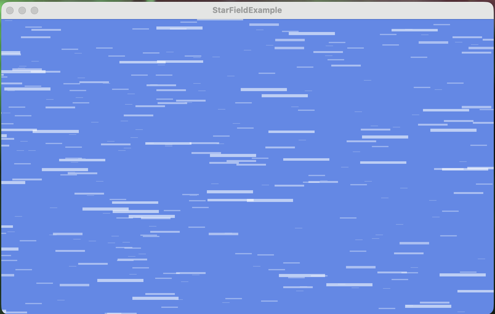

# StarField

[](https://www.nuget.org/packages/StarFieldBuddy/)

A MonoGame library that draws a shifting "hyperspace" starfield, similar to the title screen of Mega Man 8.



## How it works

`Stars` creates several `StarLayer`s of points, each with its own color, scale, and star size. When you call `Update` with a velocity, every layer scrolls its stars in that direction — layers scaled down move (and shrink) slower than layers scaled up, giving a parallax depth effect. Stars that scroll off the edge of the world rectangle are recycled to a new random position, so the field runs forever. Each star is rendered as a stretched line/streak pointing in the direction of travel, which is what produces the hyperspace look.

## Installation

Install the [StarFieldBuddy NuGet package](https://www.nuget.org/packages/StarFieldBuddy/):

```
dotnet add package StarFieldBuddy
```

## Usage

```csharp
using StarField;

// Create a starfield sized to (at least) your world/screen rectangle
Rectangle world = new Rectangle(0, 0, GraphicsDevice.Viewport.Width, GraphicsDevice.Viewport.Height);
var starBackground = new Stars(GraphicsDevice, world, starSizeScale: 0.25f);

// In Update, drive the stars with a velocity (e.g. shoot them to the left)
starBackground.Update(new Vector2(-5.0f, 0.0f), world);

// In Draw, render with non-premultiplied blending so alpha blends correctly
spriteBatch.Begin(blendState: BlendState.NonPremultiplied);
starBackground.Render(spriteBatch);
spriteBatch.End();
```

## Projects

- **StarFieldBuddy** — the library, packaged as a NuGet package targeting `net8.0`.
- **StarFieldExample** — a runnable MonoGame DesktopGL sample showing the starfield in action.

## Building the example

```
cd StarFieldExample
dotnet run
```

## License

MIT
